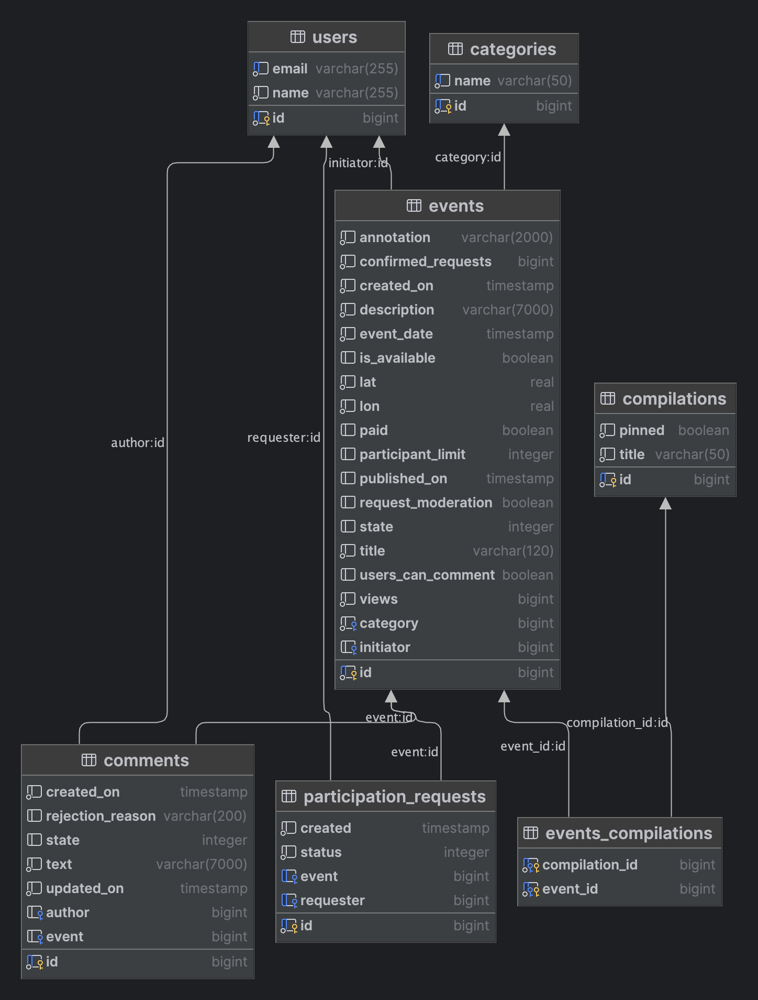

# java-explore-with-me

Описание

Двухмодульное приложение-микросервис для размещения и поиска событий, в котором функционал различается в зависимости от
роли (публичный, авторизованный пользователь или администратор).

Приложение состоит из основного сервиса, основной БД, сервиса статистики просмотров, БД для статистики. Каждая часть
поднимается в отдельном docker-контейнере.

## Стек:

- Java 11 (Core, Collections, Optional, Stream)
- Spring Boot
- Hibernate
- PostgreSQL
- Maven
- Lombok
- Postman
- Docker

## Endpoints

- [Спецификация API основного сервиса](./ewm-main-service-spec.json)
- [Спецификация API сервиса статистики](./ewm-stats-service-spec.json)

## ER-диаграмма основного сервиса

